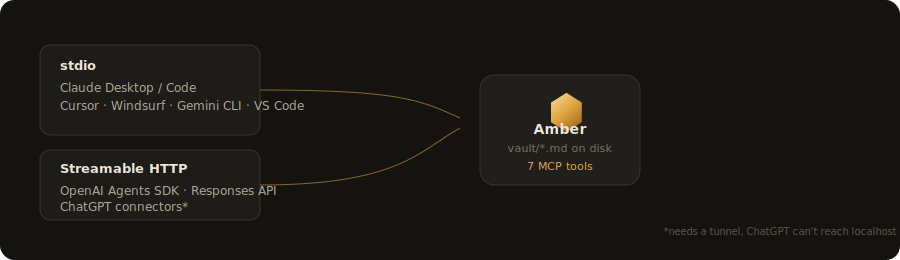

<p align="center">
  
</p>

<p align="center">
  <a href="https://github.com/DefinitelyNotVibeCoded/amber/blob/main/LICENSE"></a>
  <a href="https://github.com/DefinitelyNotVibeCoded/amber/blob/main/package.json"></a>
  
  
  
  
</p>

Amber is a local, Obsidian-style app for [Open Knowledge Format](https://github.com/GoogleCloudPlatform/knowledge-catalog/tree/main/okf)
(OKF) bundles, a knowledge base made of plain markdown, meant to be read and
maintained by both you and AI agents.

Where Obsidian is opaque volcanic glass built around its own note-taking
conventions, Amber is the transparent, preserving counterpart: a reader,
editor, and **MCP server** for a format designed to be read by anyone's
tooling, not just its own.

## Features

- **Vault browser**: folder tree sidebar grouped by type, full-text search, type/tag filters
- **Note view**: parses OKF frontmatter (`type`, `description`, `resource`, `tags`, `timestamp`) into a metadata card above the rendered markdown
- **Knowledge graph**: force-directed view of every OKF link, colored by `type`, with backlinks on every note
- **In-place editing**: writes straight back to the `.md` file on disk, no database
- **New note**: scaffolds a conformant OKF file (`type` required, everything else recommended)
- **Desktop app**: packaged with Electron, its own window, its own taskbar icon, not a browser tab
- **Built-in MCP server**: read *and* write the vault from Claude, Cursor, OpenAI, and more (see below)

## Quick start

```bash
git clone https://github.com/DefinitelyNotVibeCoded/amber.git
cd amber
npm install
npm run electron:dev
```

That launches Amber as a real desktop window against the sample OKF bundle in
[`vault/`](vault), a small bundle about OKF itself, so there's something to
click around immediately. Point it at any other folder from **Settings → General**.

Prefer a browser tab instead of a desktop window? `npm run dev` and open
`http://localhost:3000`.

## MCP: read and write your vault from AI tools

<p align="center">
  
</p>

Amber ships an MCP server with 7 tools (`get_vault_info`, `list_notes`,
`search_notes`, `read_note`, `get_backlinks`, `write_note`, `create_note`)
over **two transports**, so the same vault stays in sync whether you're
editing in the app or chatting with an agent:

| Transport | For | Command |
| --- | --- | --- |
| stdio | Claude Desktop, Claude Code, Cursor, Windsurf, Gemini CLI, VS Code | `npm run mcp` |
| Streamable HTTP (loopback-only) | OpenAI Agents SDK, Responses API, ChatGPT connectors\* | `npm run mcp:http` |

\* ChatGPT's connector picker only accepts a public HTTPS URL. Tunnel the
local HTTP server (`npx mcp-remote http://127.0.0.1:8420/mcp`, or a Cloudflare
Tunnel) to use it there.

Every client's exact config (JSON snippets, file paths, and copy-paste code
for the OpenAI SDKs) is generated live in **Settings → MCP Server** with real
absolute paths for your machine.

## Project structure

```
amber/
  vault/              sample OKF bundle (swap for your own via Settings)
  mcp/
    tools.ts           the 7 tool definitions, shared by both transports
    server.ts           stdio entry point
    http-server.ts       Streamable HTTP entry point (loopback only)
  electron/main.js      desktop window shell
  src/
    lib/                 OKF parsing, vault read/write, config
    app/                  Next.js pages + API routes
    components/           sidebar, note view, graph view, settings, editor
```

## Tech

Next.js (App Router) + TypeScript + Tailwind for the app, `gray-matter` +
custom link resolution for OKF parsing, `d3-force` for the graph layout,
`@modelcontextprotocol/sdk` for MCP, Electron for the desktop shell.

## License

[MIT](LICENSE)
