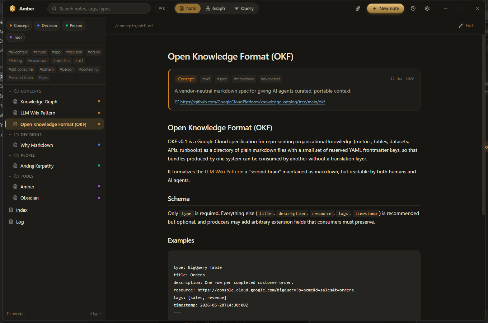
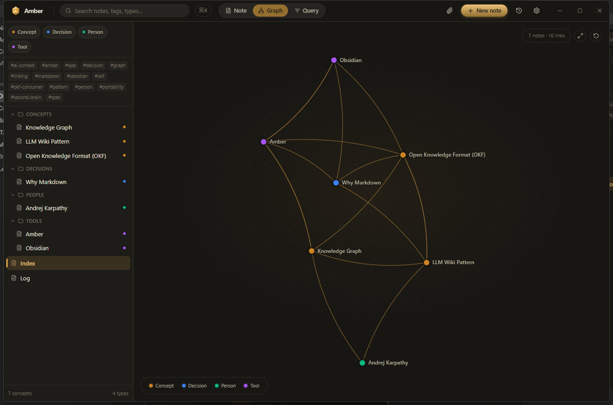
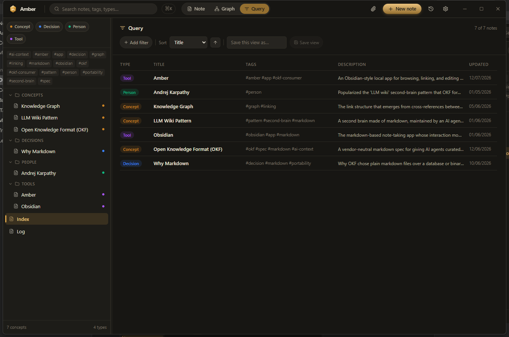
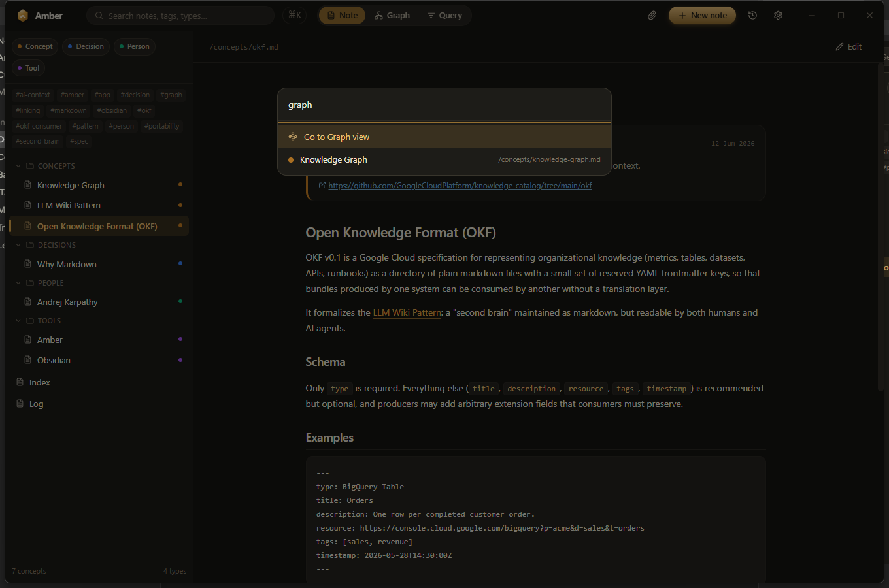
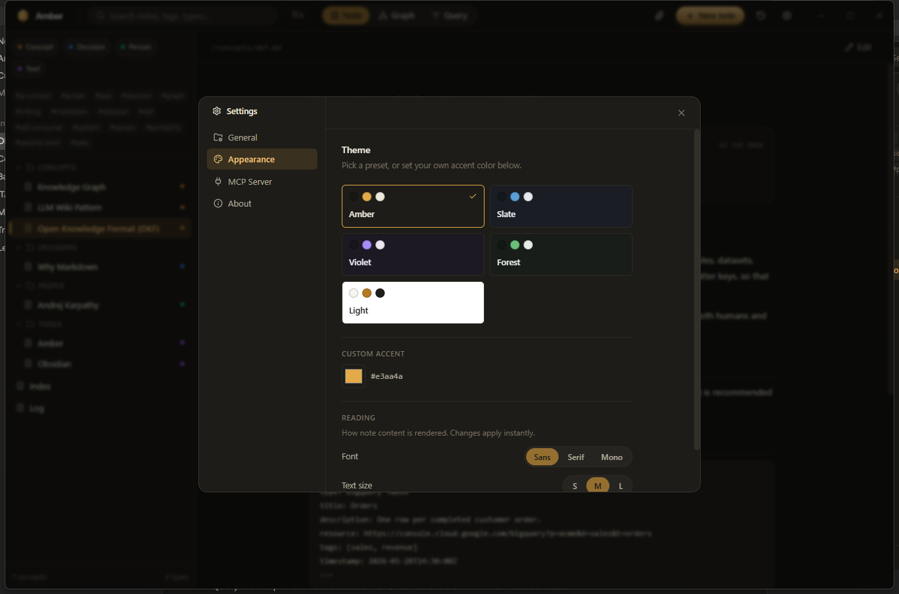

<p align="center">
  
</p>

<p align="center">
  <a href="https://github.com/DefinitelyNotVibeCoded/amber/releases/latest"></a>
  <a href="https://github.com/DefinitelyNotVibeCoded/amber/releases/latest"></a>
  <a href="https://github.com/DefinitelyNotVibeCoded/amber/blob/main/LICENSE"></a>
  <a href="https://github.com/DefinitelyNotVibeCoded/amber/stargazers"></a>
  
  
  
</p>

<p align="center"><b>
  Amber is a free, open-source, Obsidian-style desktop app for
  <a href="https://github.com/GoogleCloudPlatform/knowledge-catalog/tree/main/okf">Open Knowledge Format</a>
  (OKF) vaults, built from day one to be read and edited by both you and AI agents.
</b></p>

<p align="center">
  <a href="https://github.com/DefinitelyNotVibeCoded/amber/releases/latest"><b>⬇ Download for Windows</b></a>
  &nbsp;·&nbsp;
  <a href="#quick-start">Run from source</a>
  &nbsp;·&nbsp;
  <a href="#mcp-read-and-write-your-vault-from-ai-tools">MCP setup</a>
</p>

<p align="center">
  
</p>

Obsidian's file format is a proprietary wiki-link dialect locked to its own
plugin ecosystem. Amber's is [OKF](https://github.com/GoogleCloudPlatform/knowledge-catalog/tree/main/okf):
a published, vendor-neutral spec that's just markdown with a handful of YAML
frontmatter keys, no plugin required to parse it, no lock-in to leave it. And
because agents already speak markdown and MCP natively, Amber ships an
**MCP server built in**, not bolted on: Claude, Cursor, Codex, and OpenAI can
read *and write* your vault directly, with every AI-made edit logged, diffed,
and one click from being reverted.

## Screenshots

<table>
<tr>
<td width="50%"><p align="center"><sub><b>Knowledge graph</b>: force-directed, draggable, colored by type</sub></p></td>
<td width="50%"><p align="center"><sub><b>Query view</b>: filter, sort, and save views, no plugin needed</sub></p></td>
</tr>
<tr>
<td width="50%"><p align="center"><sub><b>Command palette</b>: <kbd>Ctrl</kbd>/<kbd>Cmd</kbd>+<kbd>K</kbd> to jump anywhere</sub></p></td>
<td width="50%"><p align="center"><sub><b>Fully themeable</b>: presets, custom accent, font, and text size</sub></p></td>
</tr>
</table>

## Amber vs. Obsidian

| | Amber | Obsidian |
| --- | --- | --- |
| File format | [OKF](https://github.com/GoogleCloudPlatform/knowledge-catalog/tree/main/okf), a published open spec | Proprietary wiki-link dialect |
| Source | MIT, fully open source | Closed source |
| AI agents read **and write** | Built-in MCP server, no plugin | Community plugins only, read-mostly |
| Audit trail for AI edits | Built-in Activity Log with diffs and one-click revert | None |
| Filter/sort your notes | Built-in Query view | Requires the Dataview plugin |
| Desktop app | Free for everyone, including commercial use | Free for personal use only |
| Plugin ecosystem | Small and young | Huge and mature |

Amber isn't trying to out-plugin Obsidian. It's a different bet: keep the
format open and the AI story first-class, and let the rest stay small.

## Features

- **Vault browser**: folder tree grouped by type, full-text search, type/tag
  filters, resizable sidebar, right-click rename/delete, hover previews on
  internal links
- **Command palette**: `Ctrl`/`Cmd`+`K` fuzzy-jumps to any note or action
- **Note view**: OKF frontmatter (`type`, `description`, `resource`, `tags`,
  `timestamp`) rendered as a metadata card above the markdown, in-place
  editing that writes straight back to the `.md` file, no database
- **Document attachments**: attach a PDF, image, or any file; it's copied
  into the vault and wrapped in a real OKF note with YAML frontmatter, so it
  shows up in the sidebar, graph, and query like any other note
- **Knowledge graph**: force-directed, zoomable, draggable, colored by
  `type`, with backlinks on every note
- **Query view**: filter by `type`, `tags`, or any custom frontmatter field
  (auto-discovered), sort, save the view, no plugin, no API key
- **Theming**: 5 presets plus a custom accent color, independent font,
  text size, and note-width controls
- **Native desktop app**: Electron, frameless window, its own taskbar icon,
  not a browser tab
- **Built-in MCP server**: read *and* write the vault from Claude, Cursor,
  OpenAI, and more (see below)
- **Agent Activity Log**: every note an MCP client creates or edits is
  logged separately from your own edits, with a line diff and one-click
  revert

## Quick start

**Just want to use it?** [Download the Windows installer](https://github.com/DefinitelyNotVibeCoded/amber/releases/latest)
and run it, no Node.js, no terminal.

**Building from source:**

```bash
git clone https://github.com/DefinitelyNotVibeCoded/amber.git
cd amber
npm install
npm run electron:dev
```

That launches Amber as a real desktop window against the sample OKF bundle in
[`vault/`](vault), a small bundle about OKF itself, so there's something to
click around immediately. Point it at any other folder from **Settings → General**.

Prefer a browser tab instead of a desktop window? `npm run dev` and open
`http://localhost:3000`.

## MCP: read and write your vault from AI tools

<p align="center">
  
</p>

Amber ships an MCP server with 7 tools (`get_vault_info`, `list_notes`,
`search_notes`, `read_note`, `get_backlinks`, `write_note`, `create_note`)
over **two transports**, so the same vault stays in sync whether you're
editing in the app or chatting with an agent:

| Transport | For | Command |
| --- | --- | --- |
| stdio | Claude Desktop, Claude Code, Cursor, Windsurf, Gemini CLI, VS Code, OpenClaw, Hermes Agent | `npm run mcp` |
| Streamable HTTP (loopback-only) | OpenAI Agents SDK, Responses API, ChatGPT connectors\* | `npm run mcp:http` |

\* ChatGPT's connector picker only accepts a public HTTPS URL. Tunnel the
local HTTP server (`npx mcp-remote http://127.0.0.1:8420/mcp`, or a Cloudflare
Tunnel) to use it there.

Every client's exact config (JSON or YAML, file paths, and copy-paste code
for the OpenAI SDKs) is generated live in **Settings → MCP Server** with real
absolute paths for your machine.

### Agent Activity Log

Giving an AI agent write access to your notes only feels safe if you can see
what it did. Every `write_note` and `create_note` call, from any connected
client, is logged separately from your own in-app edits: what changed, when,
and by which tool, with a line-level diff and a one-click revert. Open it
from the history icon in the toolbar, it shows a dot when there's something
to review.

## Project structure

```
amber/
  vault/              sample OKF bundle (swap for your own via Settings)
  mcp/
    tools.ts           the 7 tool definitions, shared by both transports
    server.ts           stdio entry point
    http-server.ts       Streamable HTTP entry point (loopback only)
  electron/main.js      desktop window shell
  src/
    lib/                 OKF parsing, vault read/write, config, activity log, diff
    app/                  Next.js pages + API routes
    components/           sidebar, note view, graph view, settings, activity log, editor
```

## Tech

Next.js (App Router) + TypeScript + Tailwind for the app, `gray-matter` +
custom link resolution for OKF parsing, `d3-force` for the graph layout,
`@modelcontextprotocol/sdk` for MCP, Electron for the desktop shell.

## Contributing

Issues and pull requests are welcome. This is early software: if something's
broken, confusing, or missing, [open an issue](https://github.com/DefinitelyNotVibeCoded/amber/issues).

If Amber is useful to you, a star helps other people find it.

## License

[MIT](LICENSE)
